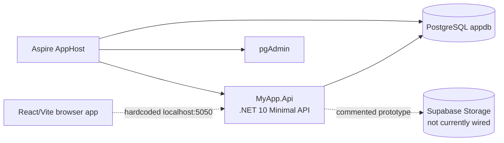
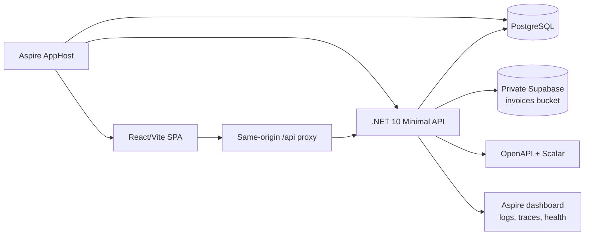
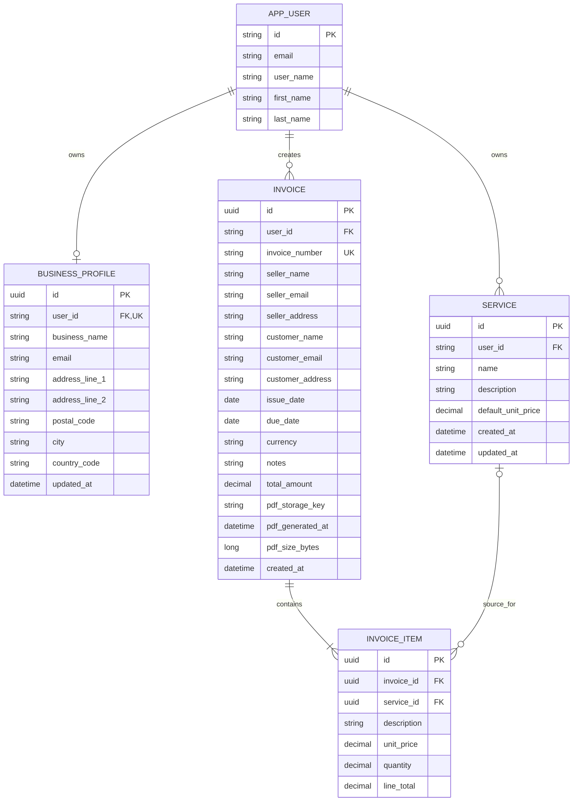
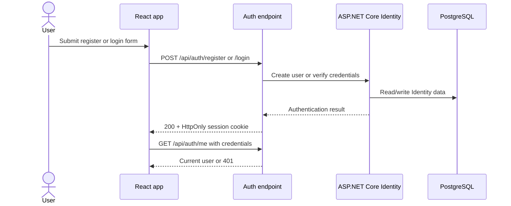
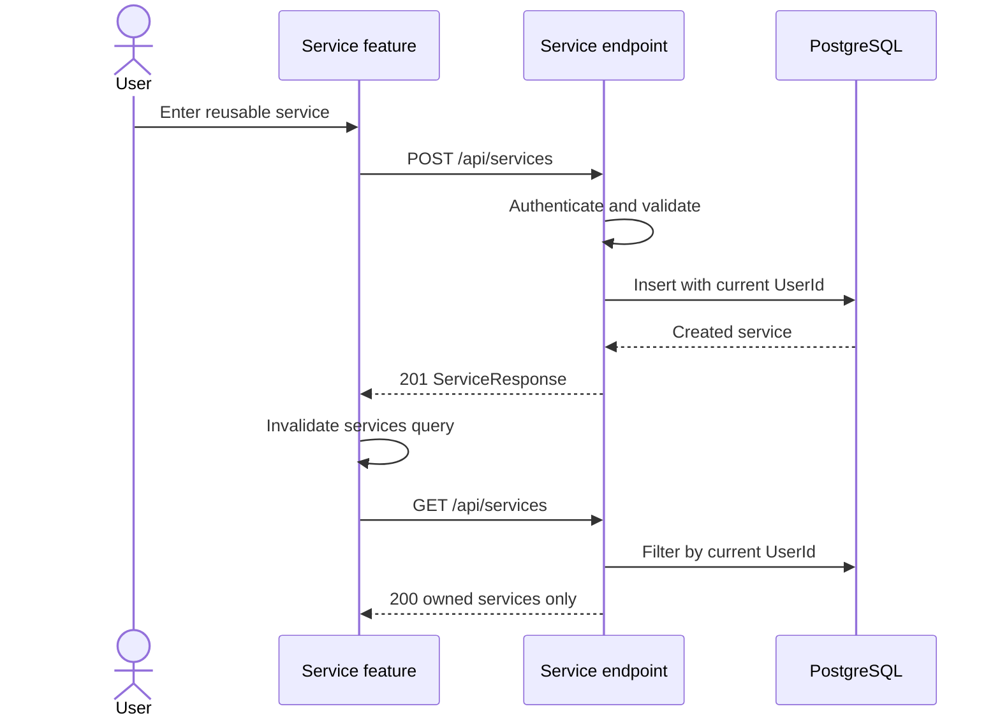
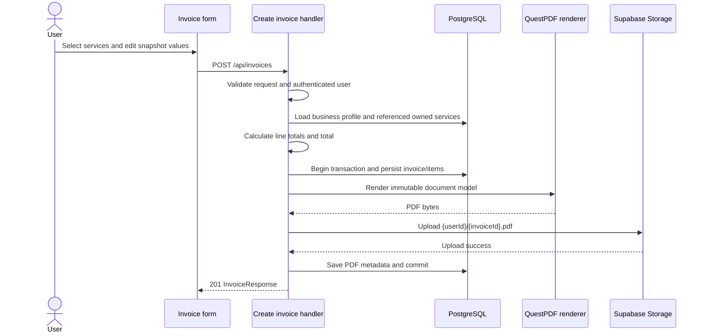
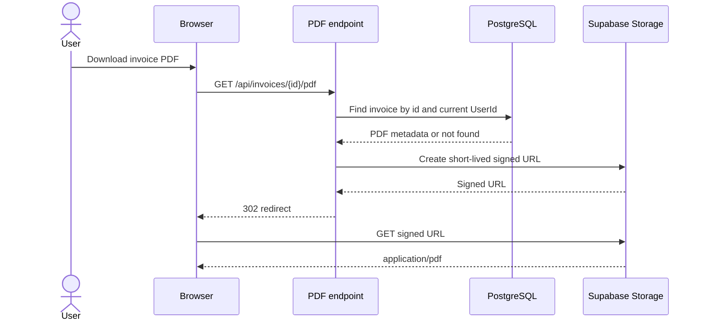

# Architecture and flows

## Purpose

This document separates the repository's current implementation from the intended learning MVP.
Anything labelled **target** still requires one or more tickets from [TASKS.md](TASKS.md).

The guiding constraints are:

- keep one deployable API and one browser application;
- organize backend behavior as vertical slices;
- use PostgreSQL as the source of truth for invoice metadata;
- store generated PDFs in a private object bucket;
- keep historical invoice values as snapshots;
- avoid abstractions that do not yet solve a concrete problem.

## Current architecture

Aspire currently owns PostgreSQL, pgAdmin, and the API. The frontend resource in `AppHost.cs` is
commented out, so contributors must start Vite separately. Authentication endpoints and the
Identity store exist. The invoice endpoint, QuestPDF renderer, and Supabase upload path are not
functional.

## Target learning-MVP architecture

For local development, Aspire becomes the single entrypoint and the browser uses relative
`/api` requests. The API remains responsible for authentication, authorization, calculations,
PDF generation, and storage access. Supabase credentials never enter the browser bundle.

## Target data model

`AppUser.Id` remains the existing ASP.NET Core Identity string key. Changing Identity to `Guid`
would create migration and authentication churn without improving the learning MVP.

### Snapshot rules

- `BusinessProfile` stores the user's current seller information.
- Seller fields are copied to `Invoice` when an invoice is created.
- Customer details live directly on `Invoice`; there is no `Customer` entity in the MVP.
- Selecting a reusable `Service` prefills an invoice line, but `InvoiceItem` stores its own
  description and price.
- Changing a profile or service never changes an existing invoice or PDF.
- `ServiceId` is optional so a user can enter a one-off invoice line.

### Data rules

- Money uses C# `decimal` and PostgreSQL `numeric(18,2)`.
- Quantity uses `decimal` and PostgreSQL `numeric(18,3)`.
- `LineTotal` and `TotalAmount` are calculated by the backend and rounded to two decimals.
- Invoice dates use `DateOnly`; timestamps are UTC.
- Currency is stored as a three-letter uppercase code and is restricted to `EUR` in the MVP.
- The visible number is a string such as `INV-2026-A1B2C3D4`, derived from the invoice ID. It is
  readable and practically unique, but deliberately not claimed to be legally sequential.
- `(UserId, InvoiceNumber)` is unique. `BusinessProfile.UserId` is unique.

## Application boundaries

| Boundary | Responsibility |
| --- | --- |
| React route | URL state, authentication gate, query preloading, and page composition |
| Frontend feature | Zod schema, form behavior, hand-written contract, API adapter, query/mutation, and feature UI |
| Minimal API endpoint | HTTP route, authorization metadata, OpenAPI metadata, binding, and typed response |
| Handler | Ownership checks, use-case orchestration, calculation, persistence, and failure mapping |
| Validator | Request-shape and cross-field validation that does not require database access |
| EF Core | Relational persistence, constraints, relationships, and queries scoped to the current user |
| PDF renderer | Pure conversion from an immutable invoice document model to PDF bytes |
| PDF storage | Upload, delete compensation, and signed-URL generation behind a narrow interface |

The MVP does not add MediatR, a repository layer, a unit-of-work abstraction, domain events, or a
generic service layer. EF Core already provides the required persistence boundary.

## Authentication flow

The browser sends cookies with API requests. A `401` means no authenticated session; transport
failures and server failures must not be converted into “logged out.” Google sign-in is optional
for local MVP work and must use configuration rather than a hardcoded frontend redirect.

## Service management flow

Service names need not be globally unique. Every read or write is scoped to the authenticated
user.

## Invoice creation and upload flow

Failure behavior is explicit:

- validation or ownership failure creates no invoice and uploads no file;
- rendering or upload failure rolls back the database transaction;
- if upload succeeds but the final database commit fails, the handler attempts a best-effort
  storage delete and logs any compensation failure;
- the response never includes the private storage key;
- retries must not silently overwrite an invoice belonging to another request.

Synchronous rendering and upload are accepted for the learning MVP. Background jobs are a later
optimization only after the synchronous flow is measured.

## PDF download flow

Returning `404` for a missing or foreign invoice avoids revealing whether another user's invoice
exists. Signed URLs are short-lived and are generated only after the API ownership check.

## Current-to-target differences

| Current implementation | Target MVP |
| --- | --- |
| Feature endpoints map outside the `/api` group | All application endpoints map below `/api` |
| Hardcoded frontend API origin | Relative `/api` through Aspire/Vite proxy |
| `InvoiceNumber` is a `Guid` | Separate `Guid` ID and readable string number |
| No business profile or seller snapshot | One profile per user and immutable seller snapshots |
| Unbounded text and unconstrained `numeric` columns | Explicit lengths, indexes, and decimal precision |
| Invoice DTO, frontend schema, and UI field names differ | One documented JSON contract with explicit frontend mapper |
| PDF and Supabase logic are commented prototypes | Injected, testable renderer and storage boundaries |
| Raw/private `PdfPath` is part of a draft response | Storage key is internal; download uses an authorized endpoint |
| Mock invoice list and status values | API-backed metadata without a status workflow |
| English and Dutch strings are mixed in components | English resources first; Dutch follows after the MVP |

## References

- [Requirements and contracts](REQUIREMENTS.md)
- [Backend conventions](conventions/BACKEND.md)
- [Frontend conventions](conventions/FRONTEND.md)
- [Aspire JavaScript integration](https://aspire.dev/integrations/frameworks/javascript/)
- [Supabase private bucket access](https://supabase.com/docs/guides/storage/buckets/fundamentals)
